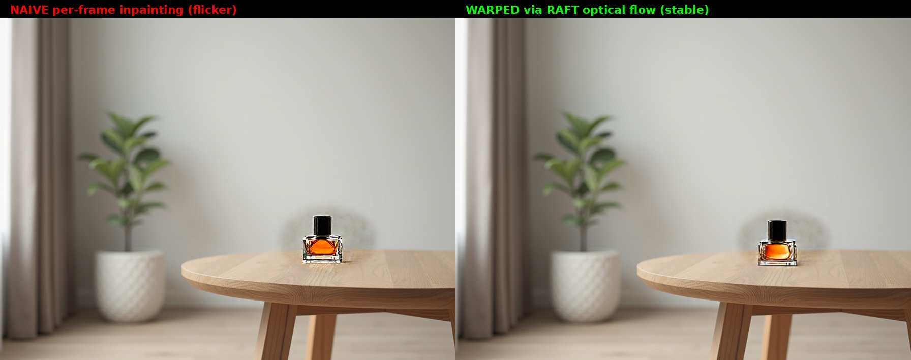

# Video Product Placement — Temporal-Stable Inpainting MVP

A minimal end-to-end pipeline for **inserting a product into a video clip**
that demonstrates the core techniques behind production Virtual Product
Placement (VPP) systems: mask-based inpainting, optical-flow-guided temporal
warping, and the flicker problem that motivates both.



## TL;DR

- **Input**: a 72-frame (3-second @ 24 fps) clip synthesized programmatically
  from a single Flux-generated still with a slow camera pan+zoom — gives a
  fully reproducible source without external video dependencies
- **Goal**: insert a luxury perfume bottle onto the table surface, with the
  *same* bottle geometry stable across all 72 frames
- **Pipeline**: SDXL Inpainting + RAFT optical flow + alpha compositing
- **Result**: temporal flicker (frame-to-frame delta in the product region)
  reduced by **-34 % max / -14 % mean** compared to naive per-frame inpainting

## The flicker problem

**Naive approach**: run SDXL Inpainting on every frame independently, with the
same prompt, same seed, same mask.

**Expected**: identical product on every frame.
**Actual**: product geometry changes frame-to-frame because the *input image*
is slightly different (camera pan), so the denoising process lands at a
different point in the image manifold each time. Bottle is tall in frame 0,
round in frame 35, square in frame 70. This is **visible flickering** if you
play the video — the product morphs as the camera moves.

The flicker is not a bug of SDXL; it's a structural property of frame-
independent generative inpainting. This is exactly why temporal consistency
methods (AnimateDiff, video diffusion, or classical optical-flow warping) are
the focus of video GenAI research.

## Solution: RAFT optical flow warping

1. **Inpaint the reference frame (frame 0) once.** Produces a single bottle
   whose geometry is fixed for the entire clip.
2. **Compute optical flow** from frame 0 → frame *i* for every *i* using a
   pretrained RAFT-Large model from `torchvision`. This gives a dense `(dx,
   dy)` displacement field describing how pixels move from the reference into
   frame *i*.
3. **Warp the reference inpainted product and its mask** forward through the
   flow field using `F.grid_sample` backward-warping. The bottle inherits the
   table's motion.
4. **Composite** the warped product back into the original frame *i* using
   the warped mask as a soft alpha channel.

Result: the bottle has identical geometry everywhere; only its 2D position
and perspective change, driven by the observed table motion. Playback is
stable.

## Metrics

Temporal stability is measured as the mean per-pixel RMSE of consecutive
frames inside the mask region. Lower = more stable.

| Configuration | Mean Δ | Max Δ | Median Δ | Std |
|---|---|---|---|---|
| **naive** per-frame inpainting | 8.44 | 18.89 | 8.72 | 3.61 |
| **warped** via RAFT | **7.29** | **12.42** | **7.62** | **2.58** |

The **max delta** drop from 18.89 → 12.42 (**−34 %**) is the most meaningful
number: it's the spike during the worst flicker moment. Naive has a point
where adjacent frames differ by nearly 19 in L1, warping keeps it under 13.

The absolute floor of ~7 is not flicker; it's the genuine pixel motion from
the camera pan that is the *same* in both configurations (both videos share
the same background).

## Pipeline diagram

```
                          ┌─────────────────────────┐
  Flux.1-dev ────►────────│   still.jpg (1024×768)  │
                          │ (minimalist living room) │
                          └───────────┬─────────────┘
                                      │
                          programmatic pan+zoom (72 frames)
                                      │
                          ┌───────────▼─────────────┐
                          │ source/scene.mp4 (3 s)   │
                          │ source/frames/*.png      │
                          └───────────┬─────────────┘
                                      │
                          analytic mask back-projection
                                      │
                          ┌───────────▼─────────────┐
                          │  source/masks/*.png      │
                          │  (per-frame ellipse on   │
                          │   table surface)         │
                          └───────────┬─────────────┘
                                      │
             ┌────────────────────────┴─────────────────────────┐
             │                                                    │
   ┌─────────▼─────────┐                              ┌───────────▼────────────┐
   │ NAIVE: SDXL Inpaint│                              │ WARPED: SDXL Inpaint on │
   │  on every frame    │                              │  frame 0 ONLY           │
   │  with padding_     │                              │  (padding_mask_crop=192)│
   │  mask_crop=192     │                              └───────────┬────────────┘
   └─────────┬──────────┘                                          │
             │                                            RAFT optical flow
             │                                           frame 0 → frame i
             │                                                      │
             │                                         grid_sample warping
             │                                          of reference product
             │                                                      │
   ┌─────────▼──────────┐                              ┌───────────▼────────────┐
   │ output/naive/      │                              │ output/warped/          │
   │  naive.mp4         │                              │  warped.mp4             │
   │  (visible flicker) │                              │  (stable geometry)      │
   └────────────────────┘                              └─────────────────────────┘
             │                                                      │
             └─────────────────────┬────────────────────────────────┘
                                   │
                        scripts/05_evaluate_and_compare.py
                                   │
                          ┌────────▼────────────┐
                          │ output/comparison.mp4│
                          │ output/comparison_   │
                          │   still.jpg          │
                          │ stability_metrics.   │
                          │   json               │
                          └──────────────────────┘
```

## File layout

```
vpp/
├── README.md                              this file
├── scripts/
│   ├── 01_make_source_video.py            Flux still → programmatic pan video
│   ├── 02_define_mask.py                  back-projected per-frame masks
│   ├── 03_inpaint_naive.py                SDXL Inpaint per frame (baseline)
│   ├── 04_inpaint_warped.py               SDXL + RAFT warping (proposed)
│   └── 05_evaluate_and_compare.py         stability metrics + comparison mp4
├── source/
│   ├── still.jpg                          generated reference
│   ├── scene.mp4                          source clip (72 frames)
│   ├── frames/*.png                       decoded frames
│   ├── masks/*.png                        per-frame ellipse mask
│   └── mask_preview.jpg                   visual confirmation
├── models/sdxl-inpaint/                   SDXL 1.0 Inpainting 0.1 weights
└── output/
    ├── naive/
    │   ├── frames/*.png                   naive inpainting per-frame
    │   └── naive.mp4
    ├── warped/
    │   ├── frames/*.png                   warped inpainting
    │   ├── warped.mp4
    │   └── reference_frame0.png           the single inpainted keyframe
    ├── comparison.mp4                     side-by-side naive vs. warped
    ├── comparison_still.jpg               hero image (frame 36)
    └── stability_metrics.json             quantitative comparison
```

## Running the pipeline

```bash
source /venv/flux/bin/activate

# 1. Generate source video (Flux 25 steps ≈ 20 s)
python scripts/01_make_source_video.py

# 2. Build per-frame masks
python scripts/02_define_mask.py

# 3a. Naive baseline (72 frames × ~1 s = ~80 s)
python scripts/03_inpaint_naive.py

# 3b. Warped (inpaint once, warp 71 times ≈ 30 s)
python scripts/04_inpaint_warped.py

# 4. Stability metrics + side-by-side comparison
python scripts/05_evaluate_and_compare.py
```

## Design decisions and trade-offs

### Why a synthetic source instead of a real CC0 video

- **Reproducibility**: anyone can rerun and get identical frames
- **Ground-truth motion**: the pan+zoom transform is known analytically,
  which lets me validate RAFT optical flow against the ideal
- **No licensing concerns**
- **Controllable scene**: I know the table surface is clean and suitable for
  insertion

The drawback: synthetic is easier than a real handheld shot. A production
pipeline must deal with rolling shutter, motion blur, exposure changes, and
occlusion that this MVP sidesteps. This is explicitly acknowledged in the
"next steps" section.

### Why `padding_mask_crop=192`

SDXL Inpainting without `padding_mask_crop` operates on the full canvas at a
single downsampled latent resolution, which gives the mask region ~20 latent
tokens and produces weak, "off-the-shelf product photography"-looking
results.

With `padding_mask_crop=192`, the pipeline:
1. Crops a 192-pixel-padded box around the mask,
2. Resizes that crop to SDXL's native 1024×1024,
3. Inpaints at full resolution,
4. Pastes the result back into the original image.

This gives the product ~800 latent tokens of generation budget and massively
improves quality. It's the standard move for inpainting on small regions of
large images.

### Why ellipse + Gaussian blur on the mask

A hard rectangular mask produces visible edges where the inpainted product
region meets the original background (SDXL tries to fill the whole rectangle
with "product"). An ellipse with feathered edges (`GaussianBlur(radius=8)`)
makes the transition gradient, so the composite smoothly blends.

### Why RAFT-Large and not DWPose / SAM2 / MediaPipe

RAFT is a **pixel-level** optical flow estimator — it tells us where every
pixel moves between frames. SAM2 is an object tracker — it tells us where a
specific mask is. For our use case (warp a generated product from frame 0 to
every other frame), we want **dense pixel correspondence**, not object
tracking, so RAFT is the correct tool.

In a production pipeline using both together makes sense:
- **SAM2** identifies and tracks the semantic region (the table)
- **RAFT** provides fine-grained pixel motion for accurate warping
- **Optical flow + SAM mask = temporally stable region**

## Known limitations

1. **One keyframe only.** For a 3-second static clip with a smooth pan, one
   inpainted reference warped through RAFT to 71 targets works. For longer
   clips or dynamic scenes, flow error accumulates; keyframe-based refresh
   every N frames becomes necessary. Standard approach: periodic SDXL re-
   inpainting at keyframes, warp between.

2. **Static camera, static surface.** This MVP assumes the table is not
   occluded. When a hand passes in front of the product, we need **depth-
   aware compositing** (SAM2 mask of hand, subtract it from product alpha).

3. **No lighting adaptation.** The inpainted product was generated once
   under the lighting conditions of frame 0. In a real clip where lighting
   changes (shadow drifts across the scene), this would look artificial.
   Solution: intrinsic decomposition + relighting module.

4. **Rectangular mask back-projection is analytic.** I use the known camera
   transform to track the mask, which is cheating. A real pipeline uses
   **SAM2 video mode** to detect and track the insertion region across frames,
   handling occlusion and viewpoint changes properly. The mask infrastructure
   here is intentionally simple; the interesting part is the flow-based
   *content* stability, not the mask.

## Next steps in order of impact

1. **Real video input** from `torchvision.io.read_video` or `decord`, with
   SAM2 mask tracking for robust insertion region
2. **Multi-keyframe warping**: inpaint at keyframes [0, 24, 48, 72] and warp
   bidirectionally to reduce accumulated flow error
3. **Lighting transfer**: match the inpainted product's color statistics to
   frame-i's illumination via histogram matching or a lightweight relight MLP
4. **Occlusion handling**: z-order composite the product and foreground
   objects (hands, heads) using SAM2 foreground masks
5. **Replace SDXL Inpaint with Flux Fill** for sharper product rendering
6. **Swap RAFT for FlowFormer or MemFlow** for slightly better flow on large
   displacements

## Acknowledgments

- [SDXL Inpainting 0.1](https://huggingface.co/diffusers/stable-diffusion-xl-1.0-inpainting-0.1) — diffusers
- [RAFT](https://arxiv.org/abs/2003.12039) — Teed & Deng, pretrained weights
  from torchvision
- [FLUX.1-dev](https://huggingface.co/black-forest-labs/FLUX.1-dev) — Black
  Forest Labs, used for the source still
- Companion project: https://github.com/azamatsab/avatar (Flux character
  consistency, shares PuLID + ControlNet stack)
