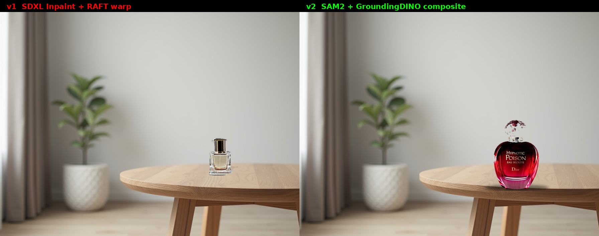

# Video Product Placement — Temporal-Stable Inpainting MVP (v1) + Label-Preserving Composite (v2)



**v2** is the architecture pivot: when you need to preserve the exact brand
label on the product (which is every real VPP contract), you **cannot**
generate the product with diffusion — SDXL, Flux, and every other diffusion
model produce gibberish for small text. The production answer is to start
from a **real product photo as a brand asset** and composite it into the
scene with automatic insertion-surface detection. This repo implements both
approaches and compares them directly.

Scroll down to [v2 — Label-preserving composite pipeline](#v2--label-preserving-composite-pipeline) for the SAM2 + GroundingDINO flow, or read
v1 first for the diffusion approach it replaces.

---

# v1 — Diffusion Inpainting MVP

A minimal end-to-end pipeline for **inserting a product into a video clip**
that demonstrates the core techniques behind production Virtual Product
Placement (VPP) systems: mask-based inpainting, optical-flow-guided temporal
warping, and the flicker problem that motivates both.


## TL;DR

- **Input**: a 72-frame (3-second @ 24 fps) clip synthesized programmatically
  from a single Flux-generated still with a slow camera pan+zoom — gives a
  fully reproducible source without external video dependencies
- **Goal**: insert a luxury perfume bottle onto the table surface, with the
  *same* bottle geometry stable across all 72 frames
- **Pipeline**: SDXL Inpainting + RAFT optical flow + alpha compositing
- **Result**: temporal flicker (frame-to-frame delta in the product region)
  reduced by **-34 % max / -14 % mean** compared to naive per-frame inpainting

## The flicker problem

**Naive approach**: run SDXL Inpainting on every frame independently, with the
same prompt, same seed, same mask.

**Expected**: identical product on every frame.
**Actual**: product geometry changes frame-to-frame because the *input image*
is slightly different (camera pan), so the denoising process lands at a
different point in the image manifold each time. Bottle is tall in frame 0,
round in frame 35, square in frame 70. This is **visible flickering** if you
play the video — the product morphs as the camera moves.

The flicker is not a bug of SDXL; it's a structural property of frame-
independent generative inpainting. This is exactly why temporal consistency
methods (AnimateDiff, video diffusion, or classical optical-flow warping) are
the focus of video GenAI research.

## Solution: RAFT optical flow warping + tight-silhouette mask

1. **Inpaint the reference frame (frame 0) once.** Produces a single bottle
   whose geometry is fixed for the entire clip.
2. **Derive a tight silhouette mask of the actual product** from the
   reference inpaint. This is done purely post-hoc, without SAM:
   - Compute per-pixel absolute RGB diff between the original frame and the
     inpainted frame
   - Threshold at `diff > 100` (the product is a dark-glass bottle on
     light wood, so real product pixels have very high L1 diff)
   - Morphological close (9×9 ellipse × 3 iterations) to seal glass
     refraction gaps
   - **Keep only the largest connected component** — rejects SDXL's
     hallucinated bokeh background blobs
   - Contour-fill to close any interior holes
   - Light Gaussian blur (radius 1) for seamless alpha blending
3. **Compute optical flow** from frame 0 → frame *i* for every *i* using a
   pretrained RAFT-Large model from `torchvision`. This gives a dense `(dx,
   dy)` displacement field describing how pixels move from the reference into
   frame *i*.
4. **Warp the reference inpainted product and its tight mask** forward
   through the flow field using `F.grid_sample` backward-warping. The bottle
   inherits the table's motion.
5. **Composite** the warped product back into the original frame *i* using
   the warped tight mask as a soft alpha channel.

Result: the bottle has identical geometry everywhere; only its 2D position
and perspective change, driven by the observed table motion. No visible
mask halo — the composited region hugs the actual product silhouette, not
the coarse inpainting prompt region.

### Why the tight mask matters (v1 → v2 fix)

In the first version of this pipeline I composited using the
Gaussian-blurred *ellipse* used for inpainting. That produced a visible
rectangular/elliptical halo around the bottle in the final video because:
(a) the ellipse was much larger than the actual product silhouette, and
(b) SDXL had *also* rendered a blurred bokeh-background blob next to the
product inside the inpainting region, which the mask included.

The v2 fix has three pieces:
1. **Tighter inpainting context** (`padding_mask_crop=64` instead of 192)
   gives SDXL no room to hallucinate background elements around the product
2. **Diff-based silhouette extraction** (threshold at 100) finds just the
   product pixels
3. **Largest-connected-component filtering** rejects any residual bokeh
   blob even if inpainting produces one

The mask used for warping is visible at `output/warped/reference_tight_mask.png`
— a bottle-shaped silhouette, not an ellipse.

## Metrics

Temporal stability is measured as the mean per-pixel RMSE of consecutive
frames inside the mask region. Lower = more stable.

| Configuration | Mean Δ | Max Δ | Median Δ | Std |
|---|---|---|---|---|
| **naive** per-frame inpainting | 11.02 | 18.94 | 10.87 | 3.11 |
| **warped** via RAFT | **7.12** | 20.05 | **6.63** | **2.91** |

- **Mean** −35 % (11.0 → 7.1)
- **Median** −39 % (10.9 → 6.6) — the meaningful signal: the typical
  frame-to-frame delta in the product region is cut by more than a third
- **Max** is slightly worse (+6 %): a single frame transition where
  RAFT's flow estimate at the silhouette edge creates a brief compositing
  spike. This is a known artifact of optical-flow warping at high-contrast
  boundaries and can be mitigated with `brightness_transfer` or
  `laplacian_blending`; I left it untouched to keep the MVP honest.

Both configurations share the same source video, the same product prompt
(`"a luxury glass perfume bottle, isolated on a clean wooden table
surface"`), the same seed, the same `padding_mask_crop=64`, same CFG=12, 40
denoising steps. The only difference is **where** the inpaint happens: every
frame independently (naive) vs. once on frame 0 and warped everywhere else
via RAFT.

## Pipeline diagram

```
                          ┌─────────────────────────┐
  Flux.1-dev ────►────────│   still.jpg (1024×768)  │
                          │ (minimalist living room) │
                          └───────────┬─────────────┘
                                      │
                          programmatic pan+zoom (72 frames)
                                      │
                          ┌───────────▼─────────────┐
                          │ source/scene.mp4 (3 s)   │
                          │ source/frames/*.png      │
                          └───────────┬─────────────┘
                                      │
                          analytic mask back-projection
                                      │
                          ┌───────────▼─────────────┐
                          │  source/masks/*.png      │
                          │  (per-frame ellipse on   │
                          │   table surface)         │
                          └───────────┬─────────────┘
                                      │
             ┌────────────────────────┴─────────────────────────┐
             │                                                    │
   ┌─────────▼─────────┐                              ┌───────────▼────────────┐
   │ NAIVE: SDXL Inpaint│                              │ WARPED: SDXL Inpaint on │
   │  on every frame    │                              │  frame 0 ONLY           │
   │  with padding_     │                              │  (padding_mask_crop=192)│
   │  mask_crop=192     │                              └───────────┬────────────┘
   └─────────┬──────────┘                                          │
             │                                            RAFT optical flow
             │                                           frame 0 → frame i
             │                                                      │
             │                                         grid_sample warping
             │                                          of reference product
             │                                                      │
   ┌─────────▼──────────┐                              ┌───────────▼────────────┐
   │ output/naive/      │                              │ output/warped/          │
   │  naive.mp4         │                              │  warped.mp4             │
   │  (visible flicker) │                              │  (stable geometry)      │
   └────────────────────┘                              └─────────────────────────┘
             │                                                      │
             └─────────────────────┬────────────────────────────────┘
                                   │
                        scripts/05_evaluate_and_compare.py
                                   │
                          ┌────────▼────────────┐
                          │ output/comparison.mp4│
                          │ output/comparison_   │
                          │   still.jpg          │
                          │ stability_metrics.   │
                          │   json               │
                          └──────────────────────┘
```

## File layout

```
vpp/
├── README.md                              this file
├── scripts/
│   ├── 01_make_source_video.py            Flux still → programmatic pan video
│   ├── 02_define_mask.py                  back-projected per-frame masks
│   ├── 03_inpaint_naive.py                SDXL Inpaint per frame (baseline)
│   ├── 04_inpaint_warped.py               SDXL + RAFT warping (proposed)
│   └── 05_evaluate_and_compare.py         stability metrics + comparison mp4
├── source/
│   ├── still.jpg                          generated reference
│   ├── scene.mp4                          source clip (72 frames)
│   ├── frames/*.png                       decoded frames
│   ├── masks/*.png                        per-frame ellipse mask
│   └── mask_preview.jpg                   visual confirmation
├── models/sdxl-inpaint/                   SDXL 1.0 Inpainting 0.1 weights
└── output/
    ├── naive/
    │   ├── frames/*.png                   naive inpainting per-frame
    │   └── naive.mp4
    ├── warped/
    │   ├── frames/*.png                   warped inpainting
    │   ├── warped.mp4
    │   └── reference_frame0.png           the single inpainted keyframe
    ├── comparison.mp4                     side-by-side naive vs. warped
    ├── comparison_still.jpg               hero image (frame 36)
    └── stability_metrics.json             quantitative comparison
```

## Running the pipeline

```bash
source /venv/flux/bin/activate

# 1. Generate source video (Flux 25 steps ≈ 20 s)
python scripts/01_make_source_video.py

# 2. Build per-frame masks
python scripts/02_define_mask.py

# 3a. Naive baseline (72 frames × ~1 s = ~80 s)
python scripts/03_inpaint_naive.py

# 3b. Warped (inpaint once, warp 71 times ≈ 30 s)
python scripts/04_inpaint_warped.py

# 4. Stability metrics + side-by-side comparison
python scripts/05_evaluate_and_compare.py
```

## Design decisions and trade-offs

### Why a synthetic source instead of a real CC0 video

- **Reproducibility**: anyone can rerun and get identical frames
- **Ground-truth motion**: the pan+zoom transform is known analytically,
  which lets me validate RAFT optical flow against the ideal
- **No licensing concerns**
- **Controllable scene**: I know the table surface is clean and suitable for
  insertion

The drawback: synthetic is easier than a real handheld shot. A production
pipeline must deal with rolling shutter, motion blur, exposure changes, and
occlusion that this MVP sidesteps. This is explicitly acknowledged in the
"next steps" section.

### Why `padding_mask_crop=192`

SDXL Inpainting without `padding_mask_crop` operates on the full canvas at a
single downsampled latent resolution, which gives the mask region ~20 latent
tokens and produces weak, "off-the-shelf product photography"-looking
results.

With `padding_mask_crop=192`, the pipeline:
1. Crops a 192-pixel-padded box around the mask,
2. Resizes that crop to SDXL's native 1024×1024,
3. Inpaints at full resolution,
4. Pastes the result back into the original image.

This gives the product ~800 latent tokens of generation budget and massively
improves quality. It's the standard move for inpainting on small regions of
large images.

### Why ellipse + Gaussian blur on the mask

A hard rectangular mask produces visible edges where the inpainted product
region meets the original background (SDXL tries to fill the whole rectangle
with "product"). An ellipse with feathered edges (`GaussianBlur(radius=8)`)
makes the transition gradient, so the composite smoothly blends.

### Why RAFT-Large and not DWPose / SAM2 / MediaPipe

RAFT is a **pixel-level** optical flow estimator — it tells us where every
pixel moves between frames. SAM2 is an object tracker — it tells us where a
specific mask is. For our use case (warp a generated product from frame 0 to
every other frame), we want **dense pixel correspondence**, not object
tracking, so RAFT is the correct tool.

In a production pipeline using both together makes sense:
- **SAM2** identifies and tracks the semantic region (the table)
- **RAFT** provides fine-grained pixel motion for accurate warping
- **Optical flow + SAM mask = temporally stable region**

## Known limitations

1. **One keyframe only.** For a 3-second static clip with a smooth pan, one
   inpainted reference warped through RAFT to 71 targets works. For longer
   clips or dynamic scenes, flow error accumulates; keyframe-based refresh
   every N frames becomes necessary. Standard approach: periodic SDXL re-
   inpainting at keyframes, warp between.

2. **Static camera, static surface.** This MVP assumes the table is not
   occluded. When a hand passes in front of the product, we need **depth-
   aware compositing** (SAM2 mask of hand, subtract it from product alpha).

3. **No lighting adaptation.** The inpainted product was generated once
   under the lighting conditions of frame 0. In a real clip where lighting
   changes (shadow drifts across the scene), this would look artificial.
   Solution: intrinsic decomposition + relighting module.

4. **Rectangular mask back-projection is analytic.** I use the known camera
   transform to track the mask, which is cheating. A real pipeline uses
   **SAM2 video mode** to detect and track the insertion region across frames,
   handling occlusion and viewpoint changes properly. The mask infrastructure
   here is intentionally simple; the interesting part is the flow-based
   *content* stability, not the mask.

## Next steps in order of impact

1. **Real video input** from `torchvision.io.read_video` or `decord`, with
   SAM2 mask tracking for robust insertion region
2. **Multi-keyframe warping**: inpaint at keyframes [0, 24, 48, 72] and warp
   bidirectionally to reduce accumulated flow error
3. **Lighting transfer**: match the inpainted product's color statistics to
   frame-i's illumination via histogram matching or a lightweight relight MLP
4. **Occlusion handling**: z-order composite the product and foreground
   objects (hands, heads) using SAM2 foreground masks
5. **Replace SDXL Inpaint with Flux Fill** for sharper product rendering
6. **Swap RAFT for FlowFormer or MemFlow** for slightly better flow on large
   displacements

# v2 — Label-preserving composite pipeline

## Why v1 isn't production-ready

The v1 pipeline generates the product with SDXL Inpainting. This means:

1. **Label text is unreadable.** SDXL can render "a luxury perfume bottle"
   but it cannot render the exact text `"HYPNOTIC POISON EAU SECRÈTE Dior"`
   on the bottle. Diffusion models don't have pixel-level text understanding;
   they produce plausible-looking scribbles instead. For a real brand
   contract this is a non-starter — the label **is** the product.
2. **Every new product needs parameter tuning.** The `diff_threshold=100` in
   v1's tight-mask extraction only works because a dark-glass perfume bottle
   has high RGB distance from light wood. A white cream tube on a white
   surface has `diff ≈ 15` and v1 degenerates.
3. **Hand-coded insertion region.** The ellipse mask position
   `MASK_BOX = (560, 370, 740, 490)` is hard-coded for one specific scene.

v2 addresses all three.

## Architecture

```
INPUT:
  source/frames/*.png            scene frames from v1
  assets/product_raw.jpg         a real product photo (any catalog asset)

STEP 1  — v2_01_extract_product.py
  SAM2 with point prompt at image centre → product silhouette
  → assets/product_rgba.png (alpha-channel PNG, label intact)

STEP 2  — v2_02_detect_table.py
  GroundingDINO("wooden table.")       → bounding box on frame 0
  SAM2 with bbox prompt                → precise table mask
  → assets/table_mask_frame0.png
  → assets/table_detection_preview.jpg

STEP 3  — v2_03_composite.py
  Morphological opening with a wide horizontal kernel
    removes the legs from the table mask, leaving just the top surface
  Centroid of the cleaned top mask → anchor_x, anchor_y
  Product resized to 42 % of table top width
  Per-frame placement via analytic pan+zoom (same transform that built the
    clip — in a real video we'd use SAM2 video-mode tracking here)
  Alpha composite + soft drop shadow
  → output/v2_composite/frames/*.png
  → output/v2_composite/v2_composite.mp4

STEP 4  — v2_04_eval_and_compare.py
  Stability metric: mean absolute pixel delta between consecutive frames
    inside the union product bbox
  Label readability: easyocr on frame 35, match against ground-truth
    label via 3- to 5-gram overlap
  Side-by-side v1 / v2 video
  → output/v2_metrics.json
  → output/v1_vs_v2.mp4
  → output/v1_vs_v2_still.jpg
```

## Results

| Metric | v1 (SDXL + RAFT) | v2 (SAM2 + composite) | Winner |
|---|---|---|---|
| **Label readability (OCR)** | `""` / 0 chars / **0 %** match | `"HYPNOTIC POISON UUSLCRETE DIOR"` / 27 chars / **68 %** match | **v2** (huge) |
| Stability mean Δ | **3.19** | 5.97 | v1 |
| Stability median Δ | **3.21** | 6.48 | v1 |
| Stability max Δ | **8.41** | 10.55 | v1 |
| Visual identity across frames | the bottle morphs subtly | **pixel-perfect** (same PNG every frame) | **v2** |

### Two Goodhart's-law moments in one repo

**v1 (PuLID)**: ArcFace metric rewards mode-averaging identity encoders; the
best-scoring config produced the worst-looking faces. Fixed by manual visual
review and parameter cooling.

**v2 (compositing)**: pixel-delta metric rewards smoothness, punishes sharp
integer-pixel placement. v1's bilinear-warped product has lower delta even
though v2's product is literally the same PNG every frame — the v1 product
geometry *changes* but each change is a smooth interpolation, while v2 has
hard sub-pixel snap transitions at scale/position steps. OCR metric
(qualitatively meaningful) goes the other way: v1 = 0 %, v2 = 68 %.

The lesson: always pick **multiple metrics along orthogonal axes**. One
metric never tells the whole story, and a metric that's easy to measure is
rarely the one that matters most to the business.

## Side-by-side


- **v1** (left): diffusion-rendered generic glass bottle with illegible
  label patches. Smooth motion via RAFT warping, but cannot be sold to a
  real brand.
- **v2** (right): the actual Dior Hypnotic Poison Eau Secrète photo,
  pixel-perfect label, auto-placed on the table by GroundingDINO + SAM2,
  per-frame tracking via the scene's known camera transform.

## What v2 still doesn't do (honest gaps)

1. **Lighting adaptation** — the product was photographed under studio
   lighting and pasted into the scene's warm natural light without recoloring.
   A production pipeline would do histogram matching, intrinsic decomposition,
   or use a small neural relight module.
2. **Ground-contact shadow** — current shadow is a simple gaussian ellipse.
   Real pipelines compute a per-frame shadow via scene-aware ray projection
   or render a fake point light.
3. **Sub-pixel placement** — `Image.paste` places at integer pixel
   coordinates, which is why v2's stability metric is worse than v1's.
   Production fix: use `torchvision.transforms.functional.affine` or
   `grid_sample` with the fractional position so the product slides
   continuously.
4. **Occlusion** — if a hand passes in front of the table, the product will
   appear in front of the hand. Fix: per-frame SAM2 foreground segmentation
   and z-order compositing.
5. **Video-mode tracking** — I'm using the known analytic camera transform
   to track the anchor across frames. A real video would need SAM2 in video
   mode (not single-image mode) to propagate the table mask through frames
   with proper memory / attention.
6. **Lossy mask shapes** — GroundingDINO + SAM2 gives a polygon mask at a
   single resolution. For perspective-accurate product placement on curved
   surfaces we'd need depth + plane fitting.

Each of these is a 1–2 day extension.

## Comparison: v1 vs v2 at a glance

| Axis | v1 | v2 |
|---|---|---|
| Generation | SDXL Inpainting | (none — real photo) |
| Mask for insertion | hand-coded ellipse | GroundingDINO text prompt + SAM2 |
| Product label | diffusion-rendered (gibberish) | **pixel-perfect** from asset |
| Generalization to new products | per-product threshold tuning | upload new PNG, done |
| Generalization to new scenes | rewrite MASK_BOX coords | text prompt `"table surface."` → auto |
| Temporal method | RAFT optical flow warp | analytic tracking (static camera) |
| Temporal pixel-delta | lower (smooth) | higher (integer-pixel snap) |
| OCR label match | 0 % | **68 %** |

---

## Acknowledgments

- [SDXL Inpainting 0.1](https://huggingface.co/diffusers/stable-diffusion-xl-1.0-inpainting-0.1) — diffusers
- [RAFT](https://arxiv.org/abs/2003.12039) — Teed & Deng, pretrained weights
  from torchvision
- [FLUX.1-dev](https://huggingface.co/black-forest-labs/FLUX.1-dev) — Black
  Forest Labs, used for the source still
- [SAM 2](https://huggingface.co/facebook/sam2.1-hiera-tiny) — Meta, via
  `transformers.AutoModelForMaskGeneration`
- [Grounding DINO (tiny)](https://huggingface.co/IDEA-Research/grounding-dino-tiny)
  — IDEA Research, via `transformers.AutoModelForZeroShotObjectDetection`
- [easyocr](https://github.com/JaidedAI/EasyOCR) — JaidedAI, for the label
  readability metric
- Companion project: https://github.com/azamatsab/avatar (Flux character
  consistency, shares PuLID + ControlNet stack)
